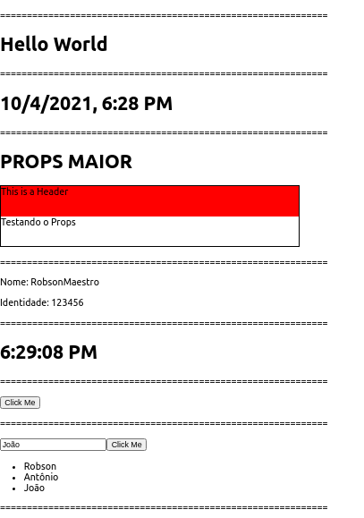

# Aplicação React Básico

Conceitos a serem desenvolvidos neste trabalho

1. Primeiro Componente
2. JSX e sua Utilização (Fazendo um Relógio)
3. Props
4. State
5. Ciclo de Vida dos Componentes
6. Trabalhando com Eventos
7. Oneway Bind e Listas

### Os commits seguem a ordem do menu acima.